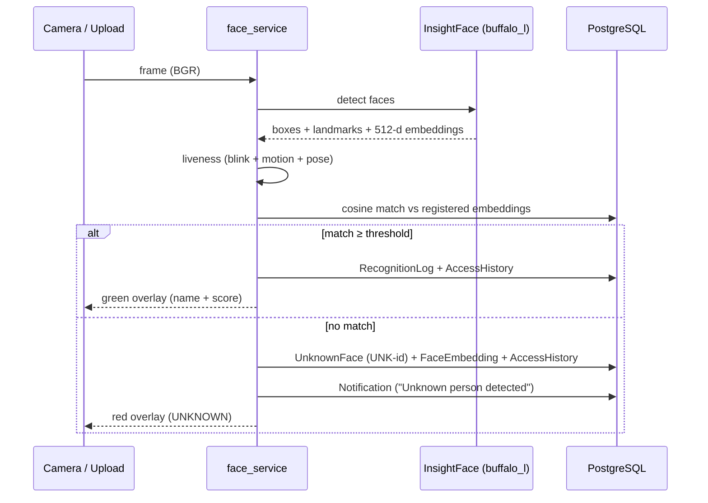
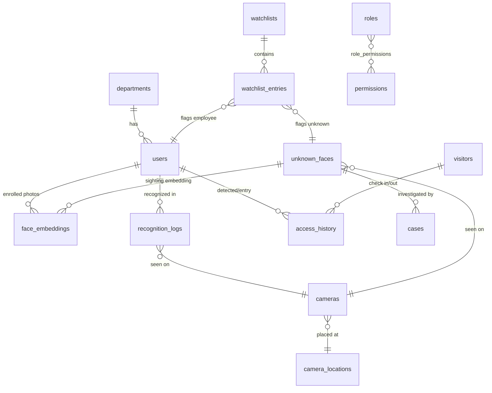

# SentinelAI — Architecture

## System overview

```mermaid
flowchart LR
    subgraph Client
        B[Browser<br/>React SPA - 21 pages]
    end

    subgraph Server["Docker host (Ubuntu)"]
        N[nginx<br/>TLS termination, static files,<br/>API + MJPEG proxy]
        subgraph Backend["backend (FastAPI, uvicorn)"]
            API[21 API routers]
            FS[face_service<br/>detect / liveness / embed / match]
            IS[investigation_service<br/>AI estimates + reports]
            NS[notification_service<br/>email / telegram / discord]
        end
        DB[(PostgreSQL 16<br/>19 tables)]
        BK[backup service<br/>daily pg_dump, retention]
        CB[certbot<br/>Let's Encrypt renewal]
    end

    CAM[Cameras<br/>webcam / RTSP]

    B -- HTTPS 443 --> N
    N -- /api --> API
    N -. /.well-known/acme .-> CB
    API --> FS --> IS
    API --> NS
    API --> DB
    FS --> DB
    BK --> DB
    FS -- OpenCV --> CAM
```

## Recognition pipeline



## Data model (core relations)



## Key design decisions

| Decision | Rationale |
|---|---|
| Embeddings cached in memory as one normalized matrix | one vectorized dot product per frame instead of a per-user loop |
| MJPEG over WebSocket/WebRTC | ``-tag simplicity; auth via short-lived token query param |
| Signed media URLs (`/api/media/...?exp&sig`) | biometric images are never served from a public static mount |
| `User.role` string + seeded RBAC catalogue tables | auth checks stay trivial; catalogue is queryable/auditable |
| AI attributes labelled estimates; absent models report `unavailable` | investigation reports never invent identity or attribute data |
| SQLite fallback when `SENTINEL_DATABASE_URL` unset | zero-config dev; production refuses to start without PostgreSQL + real secret |

## Repository layout

```
backend/            FastAPI app (app/api, app/services, app/models, alembic/)
frontend/           React SPA (src/pages, src/components, src/api)
docker/             Dockerfiles, nginx configs
deployment/         install_ubuntu.sh, backups, monitoring, deployment guide
docs/               manuals, API contract, this document
ai/                 model notes / experiments
```
